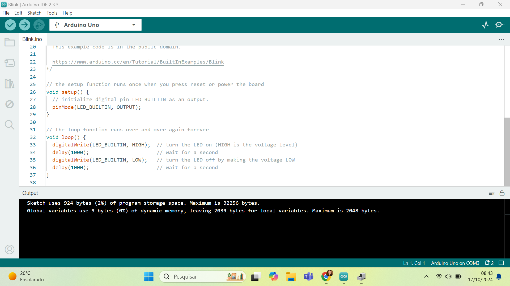

# Blink Led Interno
&ensp; Neste projeto, foi aplicado um código que faz o LED interno do Arduino UNO acender por um segundo, apagar por um segundo, e repetir esse ciclo indefinidamente, criando o efeito de "luz piscando". A implementação foi realizada utilizando a Arduino IDE.

## Evidências

**Código:** Contém o código utilizado para o funcionamento do LED.

  Figura 1 - Screenshot do Código  

    
  Fonte: Autora (2024).

**Registro:** Fotos do Arduino conectado ao computador e com o LED aceso.

  Figura 2 - Arduino UNO conectado ao computador  

    
  Fonte: Autora (2024).

  Figura 3 - Arduino UNO com LED aceso  

    
  Fonte: Autora (2024).

